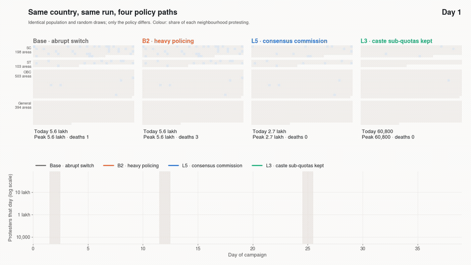
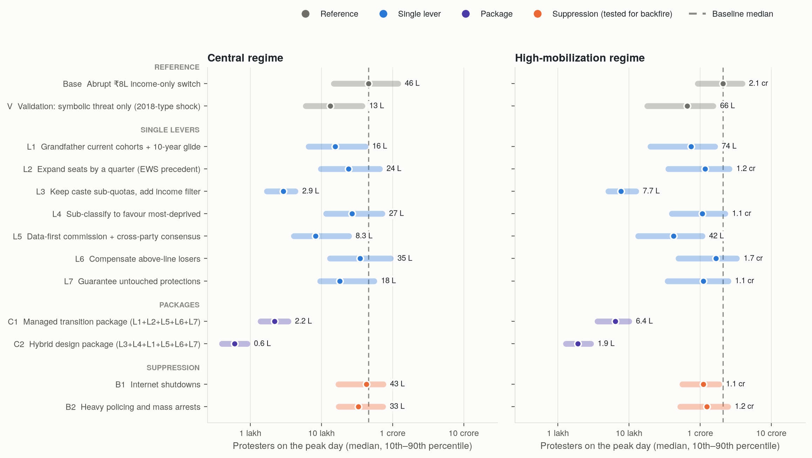
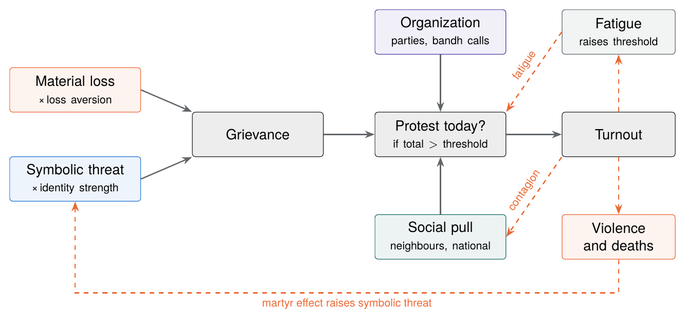
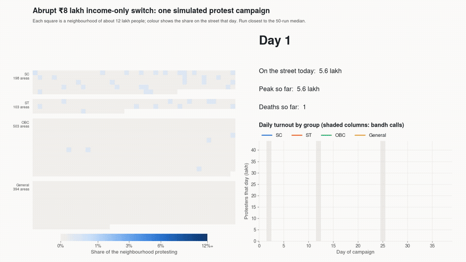
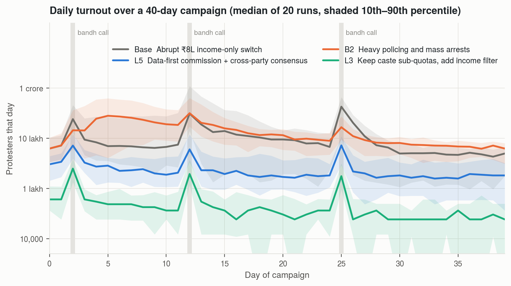
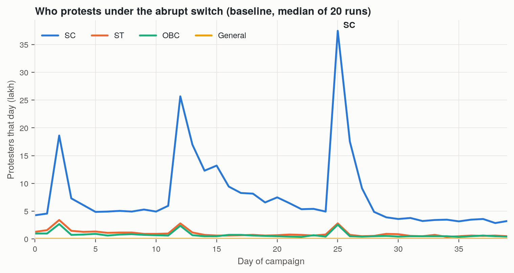
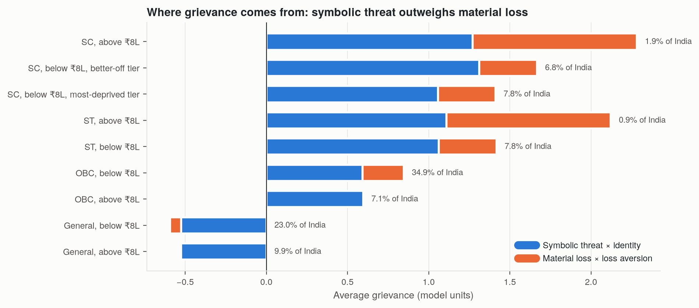
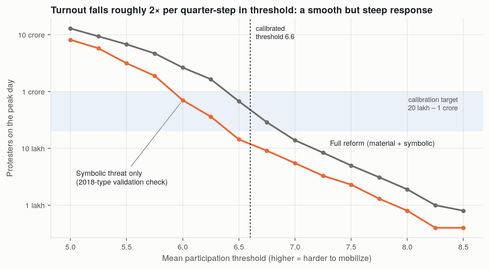
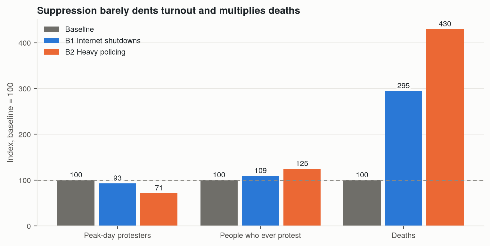
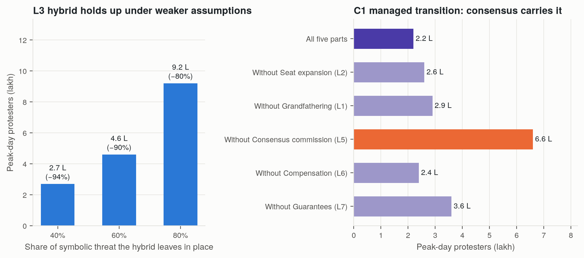

# Designing Reservation Reform Without Mass Unrest

**An agent-based simulation of protest mobilization against an income-only quota in India, and of the policy designs that would keep it small.**

Utsav Balhara · B.Tech, Netaji Subhas University of Technology (NSUT), New Delhi · September 2026

[Research report (PDF)](report/research_report.pdf) · [Interactive results page](artifact/v2/index.html) · [Usage](USAGE.md) · [Github Repo](https://github.com/utsavbalhara/reservation-reform-protest-model)



## Summary

India reserves seats in public education and government jobs for Scheduled Castes, Scheduled Tribes, Other Backward Classes and Economically Weaker Sections. This project asks what would happen if the whole system were replaced by a single income test at ₹8 lakh, and which policy designs would keep the resulting protest small.

On paper the change is small: only SC and ST families above ₹8 lakh, about 2.8% of Indians, lose eligibility. But reservation politics mobilizes around what a change means. The 2018 Atrocities Act ruling removed nobody's quota and still triggered the largest Bharat Bandh on record.

The model builds a synthetic India of 120,000 agents, each standing for about 12,000 people. Each agent's grievance combines loss-averse material loss with symbolic threat to caste recognition. Protest spreads through neighbourhood and national threshold cascades, amplified by party mobilization on bandh days, with fatigue and a martyr effect from deaths. Thirteen scenarios were each run 50 times with paired uncertainty draws, in a central and a high-mobilization regime. The model is calibrated to an independent turnout estimate and validated against the 2018 bandh.

**Findings**

- An abrupt switch draws about **46 lakh** people onto the streets on the peak day, with 1.29 crore protesting at some point and about 18 deaths over 40 days.
- **Keeping caste as the qualifier and adding an income filter inside each quota** cuts peak turnout by **94%**. Most of the anger is about losing caste recognition, not about losing a seat.
- If the income-only end state is kept, **a data-first commission with cross-party consensus** is the strongest single lever (**−82%**). A **managed transition** package reaches about 2 lakh on the peak day (**−95%**).
- **Compensating the people who lose eligibility** does little (**−24%**).
- **Internet shutdowns and heavy policing** lower the peak by 7–29% in the central regime (41–47% in the high-mobilization regime) while multiplying deaths by 2–4 times. Heavy policing increases the total number of people who ever protest.

The ranking of interventions holds across both regimes and the robustness checks; the magnitudes depend on assumed parameters.

## Results

Median of 50 paired Monte Carlo runs per scenario. Peak is the busiest single day of a 40-day campaign.

| Code | Scenario | Peak day (central) | 10th–90th | Change | Ever protest | Deaths | Peak day (high-mobilization) | Change |
|---|---|---|---|---|---|---|---|---|
| Base | Abrupt ₹8L income-only switch | 46.1 lakh | 14.9–118.9 | — | 1.29 cr | 18.5 | 209.4 lakh | — |
| V | Validation: symbolic threat only (2018-type shock) | 13.3 lakh | 6.0–37.6 | −71% | 0.47 cr | 5.5 | 66.1 lakh | −68% |
| L1 | Grandfather current cohorts + 10-year glide | 15.6 lakh | 6.6–41.5 | −66% | 0.50 cr | 5.5 | 74.2 lakh | −65% |
| L2 | Expand seats so no group loses | 24.1 lakh | 9.8–65.8 | −48% | 0.74 cr | 11 | 117.0 lakh | −44% |
| L3 | Keep caste sub-quotas, add income filter | 2.9 lakh | 1.7–4.3 | −94% | 0.10 cr | 1 | 7.7 lakh | −96% |
| L4 | Sub-classify to favour most-deprived | 26.9 lakh | 11.6–71.4 | −42% | 0.83 cr | 13.5 | 106.5 lakh | −49% |
| L5 | Data-first commission + cross-party consensus | 8.3 lakh | 4.1–24.2 | −82% | 0.41 cr | 4.5 | 42.2 lakh | −80% |
| L6 | Compensate above-line losers | 34.9 lakh | 13.1–93.9 | −24% | 1.08 cr | 16.5 | 167.0 lakh | −20% |
| L7 | Guarantee untouched protections | 18.2 lakh | 9.6–55.2 | −61% | 0.68 cr | 7.5 | 110.8 lakh | −47% |
| B1 | Internet shutdowns | 42.8 lakh | 17.2–73.7 | −7% | 1.41 cr | 54.5 | 110.6 lakh | −47% |
| B2 | Heavy policing and mass arrests | 32.9 lakh | 17.4–73.3 | −29% | 1.61 cr | 79.5 | 124.3 lakh | −41% |
| C1 | Managed transition package (L1+L2+L5+L6+L7) | 2.2 lakh | 1.4–3.4 | −95% | 0.12 cr | 1 | 6.4 lakh | −97% |
| C2 | Hybrid design package (L3+L4+L1+L5+L6+L7) | 0.6 lakh | 0.4–0.9 | −99% | 0.04 cr | 0 | 1.9 lakh | −99% |



## Scenario summaries

**Base: abrupt ₹8L income-only switch.** Every protest driver at full strength. SC communities carry most of the turnout: they face the highest symbolic threat, have the strongest organizations and include most direct losers. Turnout spikes on each bandh call and fades between them.

**V: symbolic threat only (validation).** All material loss removed, like the 2018 Atrocities Act ruling. Symbolic threat alone still produces bandh-scale protest (13 lakh), which is the check that the model's identity mechanism is realistic.

**L1: grandfathering with a 10-year glide.** People already counting on a quota keep it, and the change phases in. This removes most of the material grievance, so turnout falls almost to the symbolic-only level. It does nothing about recognition.

**L2: expand seats so no group loses.** As with EWS in 2019, capacity grows so no group's seat count falls. This helps the large below-line majority only a little each, and leaves the direct losers and the symbolic threat. A supporting measure, not a solution.

**L3: keep caste sub-quotas, add an income filter.** Caste categories stay, but only families below ₹8 lakh inside each can use them, like Brazil's 2012 Quota Law. It attacks the largest driver directly, and still cuts turnout by about 80% if it removes only a fifth of the symbolic threat. The caution: a mere suggestion of an SC/ST creamy layer triggered a bandh in 2024. It also keeps caste as a criterion, so it changes the original question.

**L4: sub-classify to favour the most-deprived.** The poorest sub-castes gain and largely stay home, but the better-off tier, which includes nearly all direct losers, keeps protesting.

**L5: data-first commission with cross-party consensus.** When every major party co-owns the reform, nobody supplies the bandh calls and buses. This is the strongest lever that keeps the full income-only end state, and the hardest to achieve.

**L6: compensate above-line losers.** Scholarships and grants for families who lose eligibility. They are under 3% of India, and money does not answer symbolic threat. The weakest lever.

**L7: guarantee untouched protections.** Legislature seats, the Atrocities Act and a review clause written into law. A 15% cut in symbolic threat produces a 61% cut in turnout, because the cascade multiplies any reduction.

**B1: internet shutdowns.** Weaker coordination trims the peak, but more deaths feed the martyr effect. In the central regime more people protest overall, and in both regimes deaths roughly double or triple.

**B2: heavy policing and mass arrests.** Force flattens the bandh-day spikes, but martyrs keep more people on the street between bandhs. 25% more people protest in total and deaths rise more than fourfold.

**C1: managed transition.** The same income-only end state reached through L1 + L2 + L5 + L6 + L7. It stays below the tipping point in both regimes. Removing the consensus commission triples turnout; removing compensation barely matters.

**C2: hybrid package.** L3 + L4 + L1 + L5 + L6 + L7. Almost nothing is left to drive a cascade.

## Theory in brief

| Mechanism | Source | In plain words |
|---|---|---|
| Loss aversion | Kahneman & Tversky (1979, 1992); Pierson (1994, 1996) | Losing a quota feels worse than never having had one. |
| Symbolic threat | Tajfel & Turner (1979) | Many protest because the change reads as erasing their community's recognition. |
| Threshold cascades | Granovetter (1978) | People join once enough others have, so small reductions in grievance can stop the chain reaction. |
| Organization | McCarthy & Zald (1977) | Anger needs machinery; parties that co-own a reform stop supplying it. |
| Repression backfire | Hess & Martin (2006); Rydzak (2019) | Force can shrink a crowd today and make protest angrier, longer and deadlier. |



## Simulation videos

Drawn frame by frame from live model runs, using the run closest to the 50-run median.

- [`videos/baseline_campaign.mp4`](videos/baseline_campaign.mp4): the abrupt switch over 40 days, neighbourhood by neighbourhood.
- [`videos/four_policy_paths.mp4`](videos/four_policy_paths.mp4): baseline, heavy policing, consensus commission and caste sub-quotas on the same population with the same random draws.



## Figures

| | |
|---|---|
|  |  |
|  |  |
|  |  |

Every figure has a vector PDF next to its PNG in `figures/`.

## Repository layout

```
protest_simulation/        the model
  synthetic_population.py    build_synthetic_india(): agents, groups, income line, neighbourhoods
  model_parameters.py        ProtestModelParameters and the calibrated baseline
  protest_campaign.py        simulate_protest_campaign(): day-by-day protest dynamics
  parameter_uncertainty.py   draw_plausible_world(): one Monte Carlo draw
  policy_interventions.py    every intervention and the scenario catalogue
  monte_carlo.py             paired Monte Carlo runs and summaries
experiments/               runs that produce results/
visualization/             figures, videos, LaTeX macros and the results page, all from results/
results/                   JSON output
figures/                   PNG and PDF figures
videos/                    MP4 simulation videos and GIF previews
report/                    research report (LaTeX source and PDF)
artifact/                  interactive results pages (v1, v2)
```

## Limitations

Grievance weights, intervention effects and neighbourhood structure are assumptions informed by qualitative evidence, not estimates from Indian protest data. The calibration target is itself an estimate. Regional variation, counter-protests, courts, elections and media are not modelled. Treat magnitudes as order-of-magnitude and the ranking as the finding.

## Citation

> Balhara, U. (2026). *Designing Reservation Reform Without Mass Unrest: An agent-based simulation of protest mobilization against an income-only quota in India.* Research report, Netaji Subhas University of Technology. https://github.com/utsavbalhara/reservation-reform-protest-model
