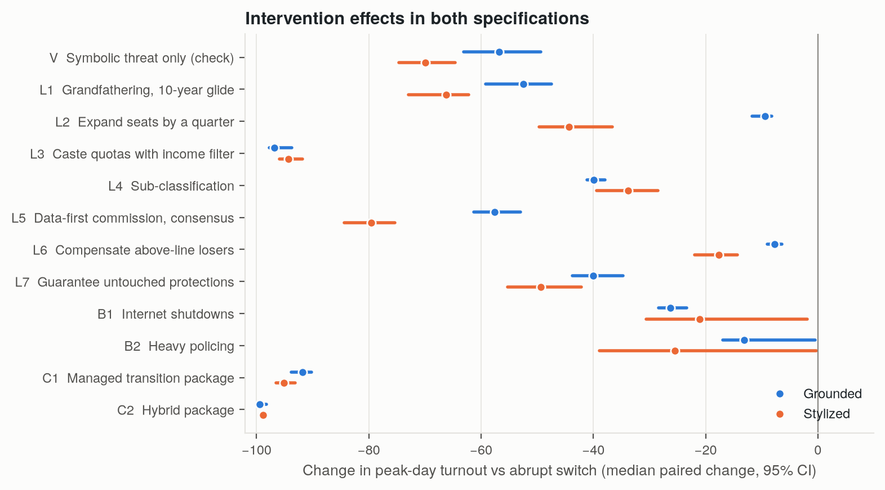
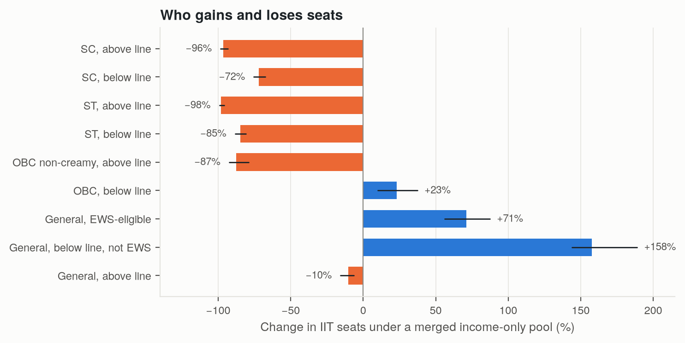
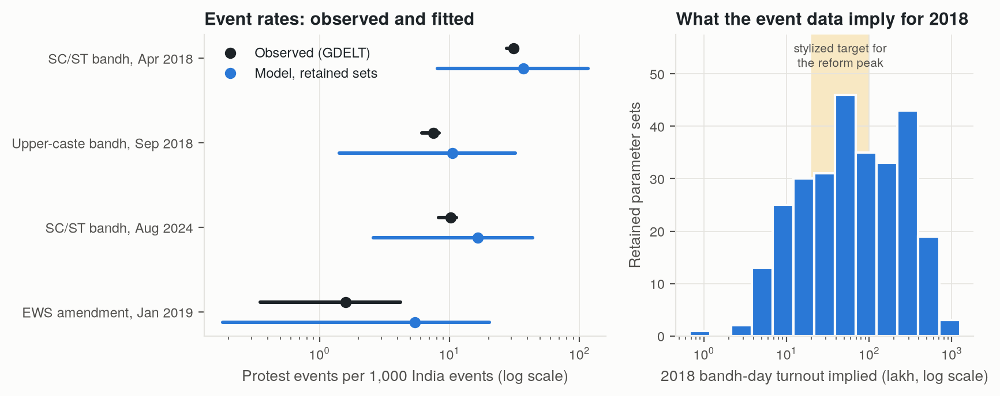
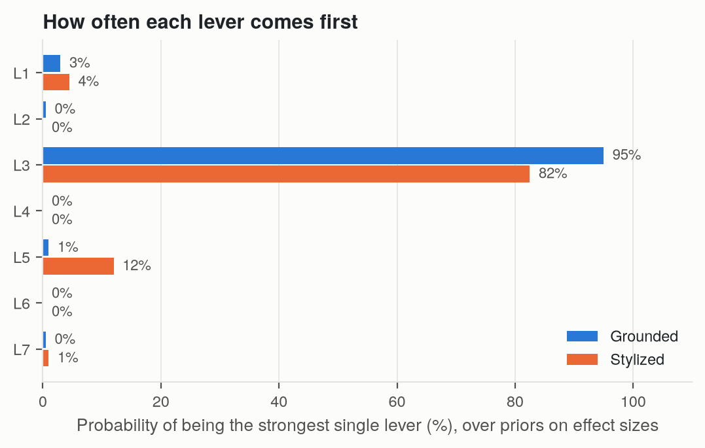
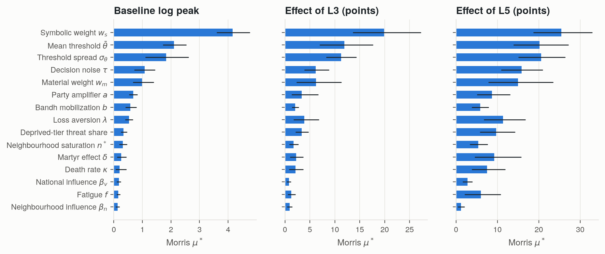
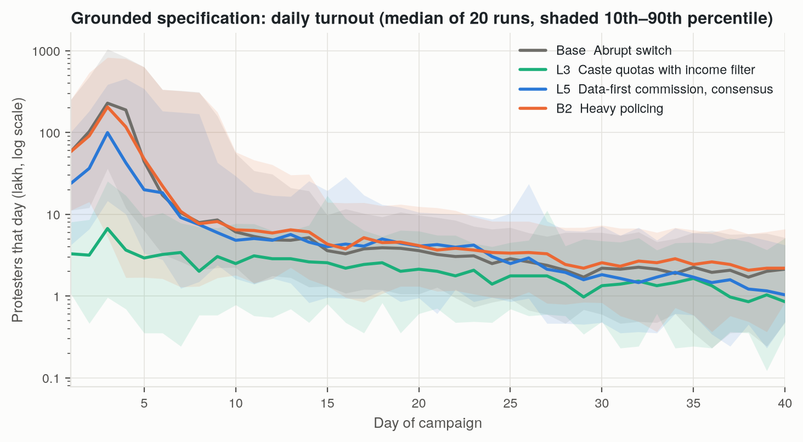
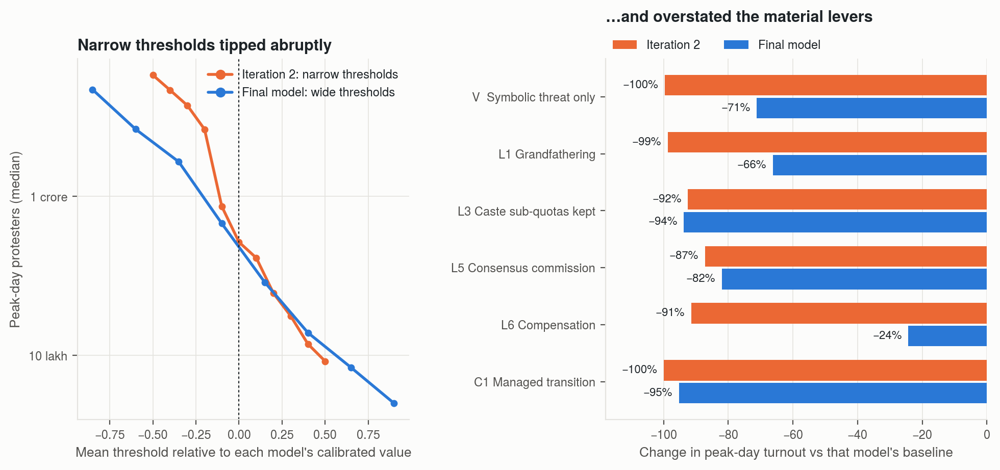
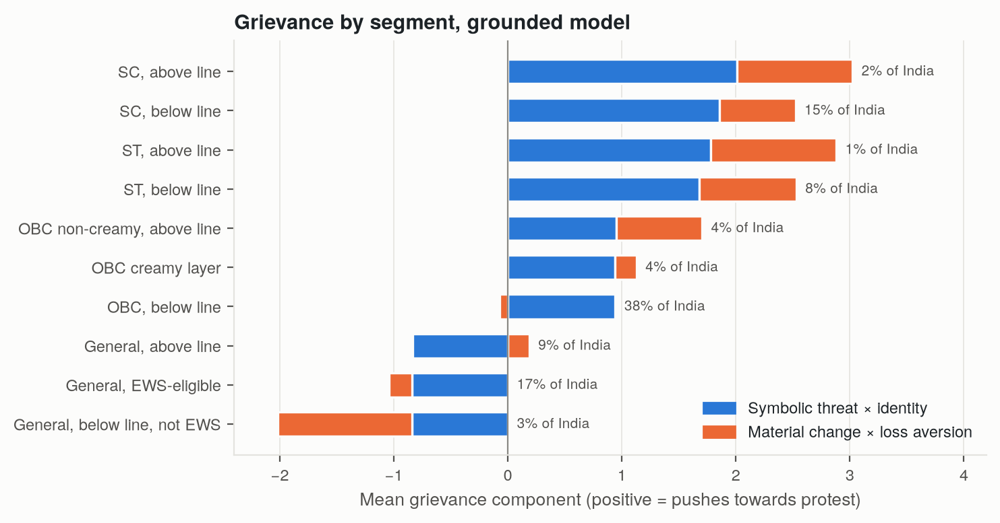
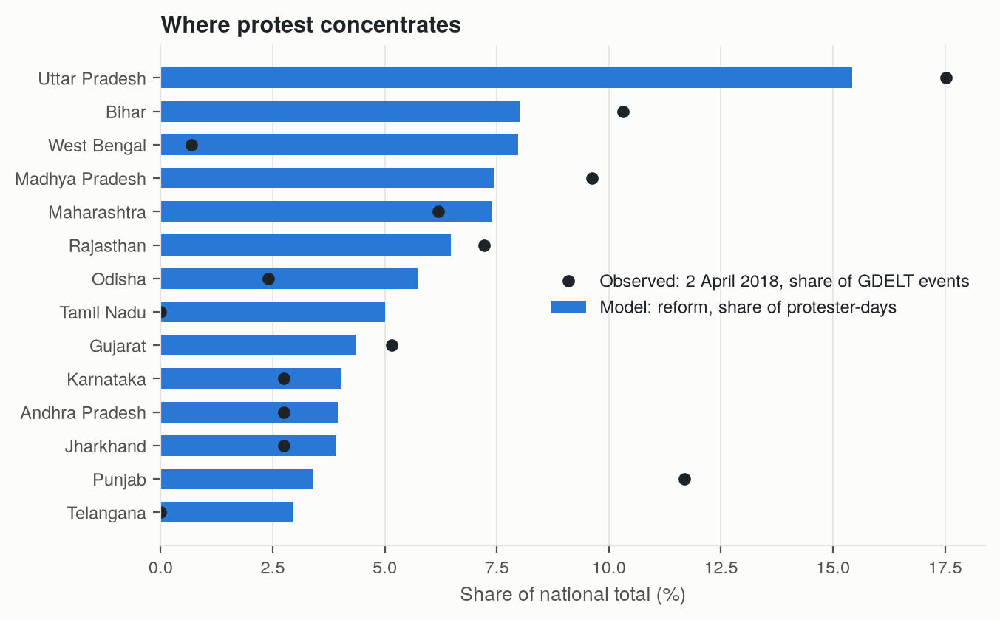

# Designing Reservation Reform Without Mass Unrest

**An agent-based model of protest against an income-only quota in India, and of the policy designs that would keep it small.**

Utsav Balhara · B.Tech, Netaji Subhas University of Technology (NSUT), New Delhi · September 2026

[Research paper (PDF)](paper/reservation_reform_protest_paper.pdf) · [Research report (PDF)](report/research_report.pdf) · [Interactive results page](artifact/v2/index.html) · [Usage](USAGE.md) · [GitHub repository](https://github.com/utsavbalhara/reservation-reform-protest-model)


## Summary

India reserves seats in public education and government jobs for Scheduled Castes, Scheduled Tribes, Other Backward Classes and Economically Weaker Sections. This project asks what would happen if the whole system were replaced by a single income test at ₹8 lakh, and which policy designs would keep the resulting protest small.

1. **Who changes status.** Under the actual creamy-layer rules (which ignore salary and farm income) and the EWS asset tests, **6.8%** of Indians lose eligibility and **3.1%** gain it. An earlier version of this project treated both income tests as one gross-income cut at ₹8 lakh and counted only SC and ST families above the line (2.8%).
2. **Who gains and loses seats.** A seat-allocation model, built on India's over-and-above choice rule (Sönmez and Yenmez 2022; Aygün and Turhan 2023) and the JEE (Advanced) rank lists for 2021–2025, finds that a merged income-only pool would cost below-line SC candidates **72%** and below-line ST candidates **85%** of their IIT seats, although they keep eligibility. The seats go to below-line General candidates.
3. **Who protests.** A synthetic India of 120,000 agents across 640 Census districts turns those losses, and the symbolic threat to caste recognition, into protest through threshold cascades, bandh calls, concession and a martyr effect. The model is history-matched to news-event counts (GDELT) for four episodes: the SC/ST Bharat Bandhs of April 2018 and August 2024, the upper-caste bandh of September 2018, and the EWS amendment of January 2019.

**What the data can and cannot tell us.** The event data pin down the relative size of past protests much better than their headcounts: the 281 surviving parameter sets imply between 7 lakh and 5.4 crore people on the 2018 bandh day. Held-out predictions of deaths and of which states protest were weak. The level of protest the reform would provoke therefore depends on assumptions the data cannot settle (from 29 lakh to 6.8 crore at peak across them). The **ranking of designs** varies much less.

**Findings** (grounded model; change in peak-day turnout against the abrupt switch in the same simulated world)

- **Keeping caste quotas and adding an income filter inside them** cuts peak turnout by **97%**. It is the strongest lever in all 11 structural variants, all 6 combinations of the unidentified assumptions, 98% of Morris design points, and 95% of draws from the priors on how strongly each lever acts. In IIT admissions it turns the seat losses of below-line SC and ST students into gains.
- **Grandfathering** (−52%) and **a data-first commission with cross-party consensus** (−58%) are the strongest levers that keep the income-only end state. Which comes first is not settled: across the priors, the commission wins only 34% of the time.
- **Adding seats on the EWS model** does little (−9%): a merged pool still ranks SC and ST candidates against General candidates. **Compensating the families who lose eligibility** is as weak (−8%).
- **Internet shutdowns and heavy policing** lower the peak by 26% and 13% while multiplying deaths by 1.4 and 2.6. Whether they also broaden protest depends on how people react to deaths, which no episode identifies.

## What this project comprises

It began as one stylized agent-based model. It is now a linked analysis whose parts can each be used on their own:

| Component | What it does | Where |
|---|---|---|
| Eligibility accounting | Who changes status under the real creamy-layer and EWS rules | `experiments/eligibility_accounting.py` |
| Seat-allocation model | Seats by group under any vertical-reservation design, using India's over-and-above choice rule, fitted to JEE (Advanced) rank lists and validated against published allotments | `merit_allocation/`, `experiments/merged_pool_allocation.py` |
| Protest model | Agent-based model on 640 districts with endogenous bandh calls, concession and backlash, and deaths; plus the original stylized model as a reference | `protest_simulation/` |
| Calibration and validation | History matching to GDELT event counts for four episodes; leave-one-episode-out predictions frozen and published before scoring; spatial tests; an ACLED cross-check pipeline | `data_pipelines/`, `experiments/episode_calibration.py` |
| Uncertainty analysis | Paired bootstrap effects, channel decompositions, priors on intervention effects, the unidentified assumptions, an 11-variant structural ensemble, Morris screening in both specifications | `experiments/` |

The project compares policy designs on the same simulated worlds and reports which comparisons survive the uncertainty. It does not forecast how many people would protest, where violence would occur, or which states organizers would carry.

## Results

Grounded model, 50 paired Monte Carlo runs per scenario. Change is the median over runs of the ratio to the baseline in the same world, with a 95% bootstrap interval. The stylized column is the original model, calibrated to an assumed 20 lakh – 1 crore peak.

| Code | Scenario | Peak day | Change (95% CI) | Ever protest | Deaths | Stylized change |
|---|---|---|---|---|---|---|
| Base | Abrupt ₹8L income-only switch | 2.14 crore | — | 3.32 cr | 95 | — |
| V | Symbolic threat only (check) | 64 lakh | −57% (−63 to −49) | 1.67 cr | 68 | −70% |
| L1 | Grandfather current cohorts + 10-year glide | 84 lakh | −52% (−59 to −47) | 1.69 cr | 70 | −66% |
| L2 | Expand seats by a quarter (EWS precedent) | 1.93 crore | −9% (−12 to −8) | 2.99 cr | 94 | −44% |
| L3 | Keep caste quotas, add income filter | 13 lakh | −97% (−98 to −94) | 0.39 cr | 10 | −94% |
| L4 | Sub-classify to favour most-deprived | 1.28 crore | −40% (−41 to −38) | 2.23 cr | 100 | −34% |
| L5 | Data-first commission + cross-party consensus | 84 lakh | −58% (−61 to −53) | 1.57 cr | 58 | −80% |
| L6 | Compensate above-line losers | 1.97 crore | −8% (−9 to −6) | 3.00 cr | 95 | −18% |
| L7 | Guarantee untouched protections | 1.14 crore | −40% (−44 to −35) | 1.92 cr | 79 | −49% |
| B1 | Internet shutdowns | 1.47 crore | −26% (−28 to −23) | 2.60 cr | 139 | −21% |
| B2 | Heavy policing and mass arrests | 1.89 crore | −13% (−17 to 0) | 3.41 cr | 220 | −26% |
| C1 | Managed transition (L2+L1+L5+L6+L7) | 19 lakh | −92% (−94 to −90) | 0.70 cr | 15 | −95% |
| C2 | Hybrid package (L3+L4+L1+L5+L6+L7) | 1.7 lakh | −99% (−100 to −98) | 0.13 cr | 2 | −99% |



## Checks and verdicts

**Stylized facts.** The grounded model reproduces four of the five facts drawn from past episodes:
- **S1:** symbolic threat alone mobilizes at bandh scale.
- **S2:** mobilization concentrates on bandh days, which average 9 times ordinary days; the peak falls on a bandh day in 66% of runs.
- **S3:** party backing is a minor amplifier. Raising it from the 2018 to the 2024 level changes the peak by a factor of 1.04; tripling the shock changes it 18-fold.
- **S4:** sub-classification splits the coalition. The most-deprived tier's participation falls 88% and the better-off tier's 20%.
- **S5** only in part: deaths and concessions occur, but the model cannot say which bandhs turn violent.

**Where the grievance comes from.** Symbolic threat is 78% of all grievance that pushes towards protest. Removing it cuts the peak by 99%; removing material change cuts it by 57%.

**Who and where.** SC agents make up 63% of protester-days and ST agents 26%. By state: Uttar Pradesh (15%), Bihar, West Bengal, Madhya Pradesh and Maharashtra. This is a demographic baseline; in 2018, Punjab, where the call began, had far more events than its population share.

**Hypotheses.** Grandfathering, caste quotas with an income filter, sub-classification, a commission and statutory guarantees all reduce protest, the income filter by far the most. Seat expansion and compensation are weak. Shutdowns and policing lower the peak by 26% and 13% and raise deaths.

A point-by-point response to the review is in [`docs/response_to_review.md`](docs/response_to_review.md).

## What changed in this revision

A reviewer asked for data where the first version had assumptions, and for statistics that separate inputs from findings.

| First version | This version |
|---|---|
| "Only 2.8% of Indians change status" | 6.8% lose and 3.1% gain eligibility under the real creamy-layer and EWS rules; below-line SC/ST lose most IIT seats in a merged pool |
| Material losses per group assumed | Taken from a seat-allocation model on JEE (Advanced) rank lists, using India's choice rules |
| National population, single-group neighbourhoods | 640 Census districts; neighbourhood mixing estimated |
| Mean threshold tuned to an assumed 20 lakh – 1 crore peak | Parameters history-matched to event counts from four episodes, with frozen and hashed leave-one-out predictions |
| 2018 assumed to have had party backing | Coded as locally organized (Scroll, 2018); party backing is an episode input |
| Fixed bandh days, no concession, Poisson deaths | Endogenous bandh calls, concession with backlash, split negative-binomial deaths, switchable |
| Ratio of medians | Paired effects with bootstrap intervals |
| One value per intervention effect | Priors on every effect; rank probabilities; channel decomposition |
| One-at-a-time sensitivity | Morris screening, an 11-variant structural ensemble, and tests of the unidentified assumptions |

The first version found that the eligibility change is small, that seat expansion on the EWS model removes the below-line loss, and that heavy policing raises total participation. The first two are wrong, and the third depends on an assumed response to deaths. The top and bottom of the lever ranking held.

## How the model was built (and what went wrong first)

The stylized model is the fourth specification. The paper documents each earlier one, and `experiments/replay_model_development.py` re-runs them with the current code.

| Iteration | Change | What went wrong | How it was caught |
|---|---|---|---|
| 1 | Linear, unbounded contagion; narrow thresholds | About 98 crore people on the street at every threshold tried | Implausible scale; contagion had no ceiling |
| 2 | Saturating contagion | Turnout tipped abruptly; grandfathering −99%, compensation −91% | A symbolic-only shock (like 2018) produced about 10,000 protesters |
| 3 | Reweighted symbolic vs material grievance | Symbolic-only shock stayed under 5% of baseline | No weighting fixed it; the thresholds were too narrow |
| 4 | Wide threshold distribution | Smooth response; symbolic-only shock at 2018 scale | Stylized model |

## Figures

| | |
|---|---|
|  |  |
|  |  |
|  |  |
|  |  |

Every figure has a vector PDF next to its PNG in `figures/`. The videos in `videos/` are drawn from live runs of the stylized model.

## Repository layout

```
merit_allocation/          seat-allocation model: rank-list data, latent merit, choice rules, merged-pool regimes
data_pipelines/            rank-list extraction, GDELT download and filtering, episode definitions, calibration targets
data/derived/              derived data (rank and category only; Census districts; NFHS-5; GDELT counts; relevance audit)
protest_simulation/        the protest model
  synthetic_population.py    national population, tiers, income line, eligibility flags, neighbourhoods
  geography.py               district population from Census 2011 and NFHS-5
  model_parameters.py        parameters and switchable structural options
  protest_campaign.py        day-by-day dynamics
  policy_interventions.py    scenario catalogue at reference values
  intervention_priors.py     priors over intervention effects
  episode_simulation.py      historical episodes as model shocks
  grounded_specification.py  the grounded specification
  specifications.py          stylized and grounded specifications
  monte_carlo.py, parallel.py  paired runs, bootstrap intervals, multiprocessing
experiments/               one script per analysis
tests/                     regression, property, reimplementation and data tests
visualization/             figures, videos, LaTeX macros and the results page, all from results/
results/                   JSON output, including frozen leave-one-out predictions
paper/, report/            LaTeX sources and PDFs
docs/                      literature and novelty search log; point-by-point response to the review
```

## Limitations

How strongly a commission, a guarantee or an income filter reduces the sense of threat is a judgement, handled with wide priors. The episodes identify relative, not absolute, protest size, so the reform's headcount is uncertain by more than tenfold. The material grievance weight is not identified. The seat model covers IIT admissions only. The GDELT relevance labels were coded from article URL text by a single coder and have not been double-coded. ACLED, a hand-coded event dataset, would give an independent check; the pipeline is built (`data_pipelines/acled_episode_events.py`, `experiments/acled_cross_check.py`) and awaits the data. Jati-level heterogeneity, state politics, courts, elections and media are not modelled. The headcounts are illustrations; the comparisons between designs are the finding.

## Citation

> Balhara, U. (2026). *Designing Reservation Reform Without Mass Unrest: An Agent-Based Model of Protest Against an Income-Only Quota in India.* Netaji Subhas University of Technology. https://github.com/utsavbalhara/reservation-reform-protest-model
