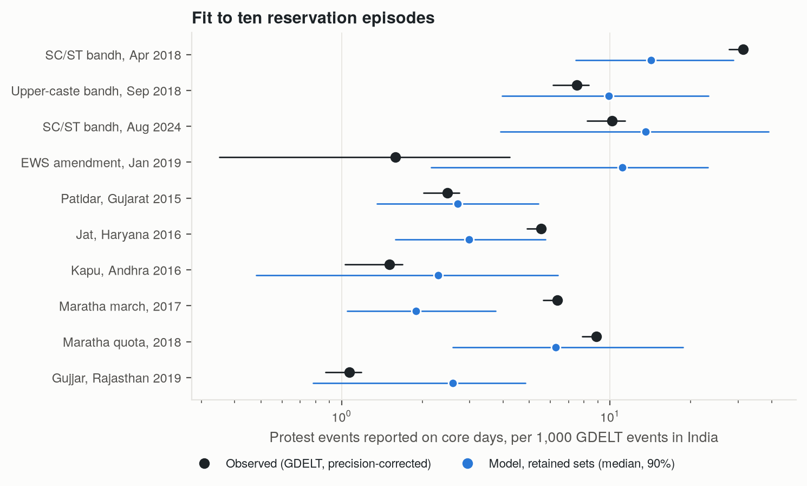
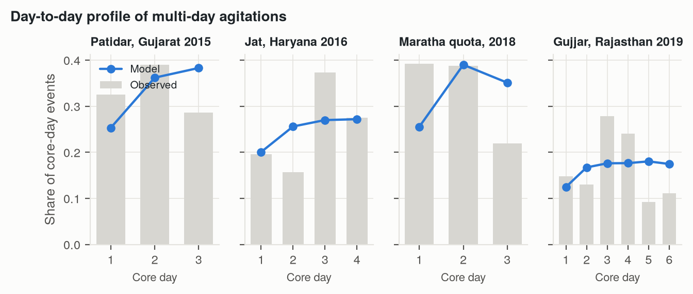
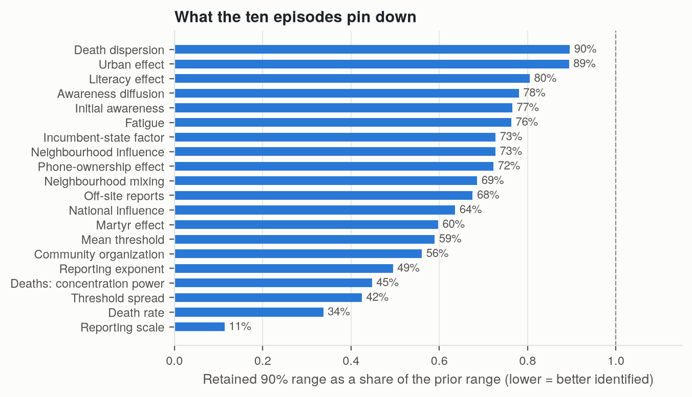
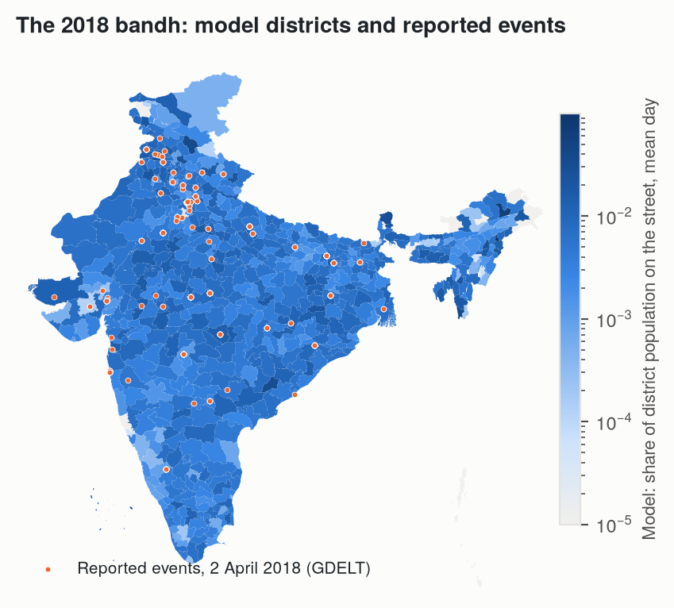
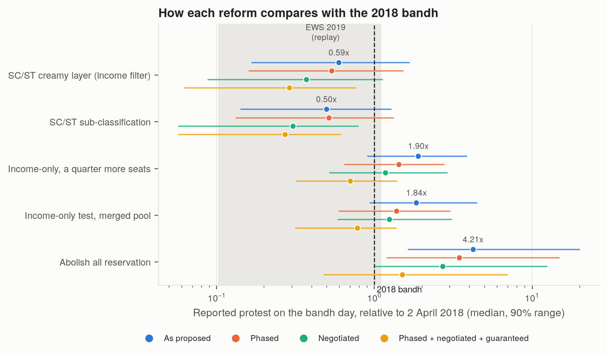
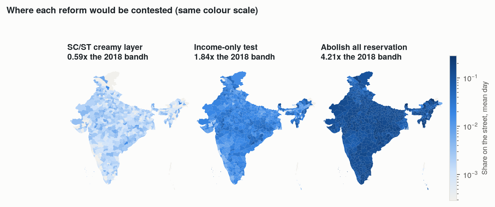
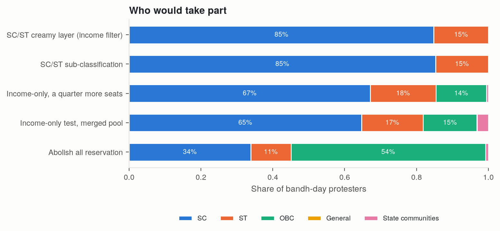
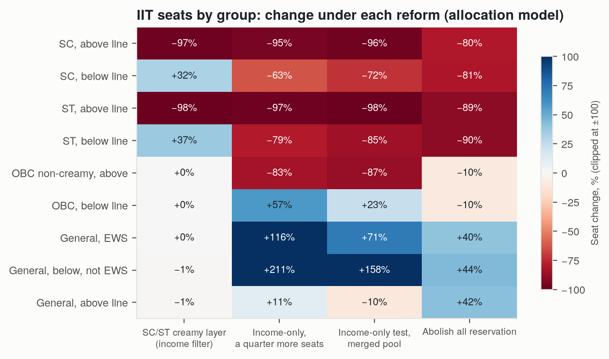

# Protest model, version 3

Version 3 rebuilds the protest model around what the data can support. The grounded specification in `protest_simulation/` is kept unchanged, so the existing paper still reproduces.

## What changed and why

| | Grounded specification (v2) | Version 3 |
|---|---|---|
| Episodes used for calibration | 4 (two-day campaigns) | 10, including six multi-day state agitations (Patidar 2015, Jat 2016, Kapu 2016, Maratha 2017 and 2018, Gujjar 2019) |
| What each episode is matched on | Event count, deaths | Event count, day-by-day profile, distribution across states, deaths, and published crowd sizes where they exist |
| Dynamics after the first day | Not fitted | Fitted on agitations of up to six consecutive days |
| Who can mobilize | SC, ST, OBC, General | The same, plus state communities that mobilized for reservation (Jats, Patidars, Kapus, Marathas, Gujjars) |
| Geography | District demography only | Also district urbanization, literacy and household phone ownership (Census 2011), with effects estimated from where events happened |
| Who can protest | Anyone whose threshold is crossed | Only people with a stake (a threat to their group or a material loss) who have heard of the protest |
| Build-up over days | None | Awareness spreads from those who heard the call to those who see protest nearby or in their group |
| Deaths | Proportional to protester-days | Also rise with how concentrated protest is in a state; the martyr effect is estimated |
| Media coverage | One extra factor for Delhi | A fitted share of reports lands outside where protest happens, spread by each state's share of all GDELT news (mostly Delhi) |
| State politics | None | Organization is stronger in states governed by the coalition a national protest targets |
| Religion | None | An upper-caste mobilization reaches Hindu members of the General category only (NFHS-5 shares) |
| Concession | Built in, assumed | Optional, off by default; no episode identifies it |
| Main output | Headcounts (crore) | Protest relative to the 2 April 2018 bandh, on the same parameter set |
| Scenarios | Levers on one reform | Five reform designs, including abolition of all reservation, each tied to its nearest episode, with phasing, negotiation and guarantees as modifiers |

## How a day works

Each person in the synthetic population (120,000 agents standing for India's 121 crore, placed in Census 2011 districts) decides each day whether to protest:

1. **Stake.** Only people whose group is threatened by the reform, or who lose at least a twentieth as much as an above-line SC candidate in the allocation model, can take part. The first calibration did not have this rule, and it put 20 to 40 lakh unaffected people on the street in every episode. That floor squeezed every episode toward the same size and spread protest by population.
2. **Awareness.** On the announcement day a share of the stakeholders hears the call. The rest can hear of it later, by seeing protest in their neighbourhood or among their own group. This is how an agitation can grow over several days instead of peaking on day one.
3. **Decision.** An aware stakeholder protests if grievance (threat and material loss), social pull (turnout nearby and in the group) and organizational push outweigh a personal threshold. Push is stronger with opposition-party backing, on called action days, and in states whose government belongs to the coalition the protest targets. Each day of protest raises the threshold (fatigue).
4. **Deaths.** Deaths are drawn from the protester-days, weighted toward states where a large share of people are on the street, and each death raises the threat felt by the groups protesting (the martyr effect).
5. **News.** Expected news events in a state are a fitted, concave function of its turnout. A fitted share of each day's reports is placed elsewhere, in proportion to each state's share of all GDELT news about India: solidarity protests, reactions, and stories filed from Delhi. This lets the model say how many events GDELT would record, which is what the calibration targets are.

### Things I tried and dropped

- **Reporting intensity.** I measured how heavily GDELT reports each state on any topic (`data_pipelines/state_reporting_intensity.py`) and multiplied each state's expected events by it. State rankings got worse: Jammu and Kashmir, reported heavily for other reasons, had no reservation protest. Its power is fixed at zero.
- **Expected instead of realized turnout.** Recording each agent's protest probability rather than its draw did not change the state rankings, so the remaining geography misses are systematic, not sampling noise.

## Files

- `population.py`: district population, Census covariates and state communities.
- `model.py`: the daily simulator and the observation model.
- `episodes.py`: the ten episodes as shocks.
- `scenarios.py`: the reform designs and modifiers.
- `experiments/v3_history_match.py`: calibration to the ten episodes, plus a spatial out-of-sample test.
- `experiments/v3_scenarios.py`: the reform scenarios, reported relative to the 2018 bandh.
- `visualization/v3_figures.py`: figures `figures/v3_*`.

Data pipelines:
- `data_pipelines/district_covariates.py`: Census covariates and the district map.
- `data_pipelines/episode_targets_v3.py`: the episode targets.

## Results

### Calibration

I simulated 48,000 parameter sets in six waves. The first wave was drawn from the priors; the rest perturbed the best sets so far. A set is kept if its second-largest implausibility is below 3 and its largest below 4, and if it meets the two published crowd ranges and the 2018 turnout bound exactly. 7,792 sets pass the first rule and 951 also pass the hard constraints. A second match of 40,000 sets leaves out the spatial targets; its 741 sets give the out-of-sample spatial test.

- **Levels.** For seven of the ten episodes, the observed level is inside the model's 90% range. The model now spans 1.9 to 14 events per 1,000 across episodes (observed 1.1 to 31); the first version of v3 spanned only 3 to 9, because of the participation floor described above. The three misses: the 2018 bandh (31 observed, model 14, range 7.5 to 29), the 2017 Maratha march (6.4 observed, model 1.9), and the EWS amendment (1.6 observed, model 11). A single huge rally in one city and a thin countrywide reaction are the two shapes the observation model handles worst.
- **Turnout.** The retained sets put 2 April 2018 at 51 lakh people on the street (90% range 15 to 94 lakh). That range comes mostly from the bound and the crowd ranges; event counts do not pin down headcounts.
- **Deaths.** For the Jat agitation the model gives 13 (5 to 53) against 30 reported, for Patidar 7 (2 to 21) against 10 to 11, and for 2018 3 (1 to 13) against 11 to 14. The episodes with no deaths get medians of 0.5 to 8. Deaths rise with how concentrated protest is in a state (power 0.23, 90% range 0.02 to 0.69), so a concentrated agitation is deadlier per protester than a thin bandh.
- **Where protest happens.** Across the 20 states with more than a crore people (Delhi excluded), I compare the model's ranking of states by expected events with the ranking by reported events (Spearman):

  | Episode | Model, fitted with spatial targets | Model, fitted without them | Population | SC+ST population |
  |---|---|---|---|---|
  | SC/ST bandh, April 2018 | **0.52** | **0.51** | 0.38 | 0.49 |
  | SC/ST bandh, August 2024 | 0.45 | 0.37 | 0.57 | 0.72 |
  | Upper-caste bandh, September 2018 | 0.25 | 0.18 | 0.60 | 0.63 |

  For 2018 the model now beats both baselines, in and out of sample. For the other two it does not. Simple population counts still rank states better than the model for those two bandhs.
- **Incumbent states.** Organization is 3.1 times stronger (90% range 1.6 to 4.5) in states governed by the coalition a national protest targets. This is the one new behavioural quantity the data pin away from "no effect". I chose the covariate after seeing the state patterns, so treat it as a finding to test on the next bandh, not as confirmed.
- **Day profiles.** Awareness now makes agitations build up over their first days, as the Jat and Gujjar agitations did. The model then plateaus: it does not reproduce the Jat and Gujjar peaks on day three, or the Patidar and Maratha declines.

- **What is identified.** Eight quantities have 90% ranges under half their prior width: the reporting scale and exponent, the death rate and its concentration power, the spread of thresholds, and the threats in the 2018 bandh and the Jat and Patidar agitations. Awareness, social influence, fatigue, neighbourhood mixing and the Census covariates stay above 60 per cent of their prior range. Relative to 2018, the fitted threats are about 1.5 to 1.9 for the community agitations, 0.6 to 0.7 for the upper-caste and 2024 bandhs, and 0.5 for the EWS amendment.

### Scenarios

Each reform is run on 300 retained sets and compared with a replay of 2018 on the same set, so the unidentified headcount scale cancels. "Phased" lowers the material loss in the first year; "negotiated" means no opposition party backs the protest; "all three" adds a credible guarantee. Reforms are simulated with the state governments of August 2024. The seat changes come from the allocation model on JEE (Advanced) rank lists.

| Reform | Protest vs 2018 (median, 90% range) | Chance it exceeds 2018 | With all three modifiers |
|---|---|---|---|
| Abolish all reservation | 4.2x (1.6 to 20) | 100% | 1.5x (0.5 to 6.9) |
| Income-only, a quarter more seats | 1.9x (0.9 to 3.8) | 92% | 0.70x |
| Income-only test, merged pool | 1.8x (0.9 to 4.4) | 93% | 0.78x |
| SC/ST creamy layer | 0.59x (0.17 to 1.7) | 19% | 0.29x |
| SC/ST sub-classification | 0.50x (0.14 to 1.3) | 11% | 0.27x |
| EWS amendment, 2019 (replay) | 0.49x (0.10 to 1.1) | 6% | |

What the scenarios say, and how far to trust it:

- Abolition is the only design that exceeds 2018 in every run, with a median of 6.4 crore people on the street on the bandh day (90% range 0.9 to 38 crore). That headcount leans on the turnout bound and should be read as "far beyond anything in the data". It is also the design with the weakest grounding: no episode resembles it, so its threat is a prior (between one and two times the income-only threat, with OBCs threatened as much as SCs). Under abolition, OBCs would be over half of those on the street. In the allocation model, SC seats fall by about 80 per cent and ST seats by about 90 per cent, while General seats rise by 40 to 44 per cent.
- Income-only designs exceed 2018 in more than nine runs out of ten. Adding a quarter more seats does not change that. The model gives both designs the same threat to group status, which was fitted on 2018 and the EWS amendment, and the seat changes move turnout only a little.
- The two designs tied to the 2024 episode, the creamy layer and sub-classification, stay below 2018 in most runs. Their ranges are narrower because the 2024 bandh constrains them.
- Phasing, negotiation and a guarantee together cut protest by 46 to 64 per cent, depending on the design. Each modifier's effect is a prior, not something any episode measured.
- The ranking of designs is more robust than the multiples. The multiples inherit the level misses above, and the threat priors for abolition and income-only are wide.

## What it still cannot do

- It does not forecast headcounts. Results are relative to 2018, which is what the event data identify.
- It beats simple demographic baselines at ranking states for the 2018 bandh, but not for the 2024 or upper-caste bandhs.
- Agitations build up but then plateau; the model does not reproduce peaks on day three followed by decline.
- The incumbent-state covariate was chosen after seeing the data.
- Each scenario's threat is tied to its nearest episode where one exists. Income-only and abolition have no close episode, so their threat is a wide prior.
- The state communities' population shares are commonly cited estimates; there has been no caste census since 1931.
- The relevance labels behind the event counts were assigned by a language model from article URLs and have not been checked by hand.
